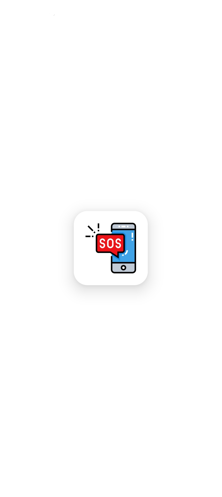
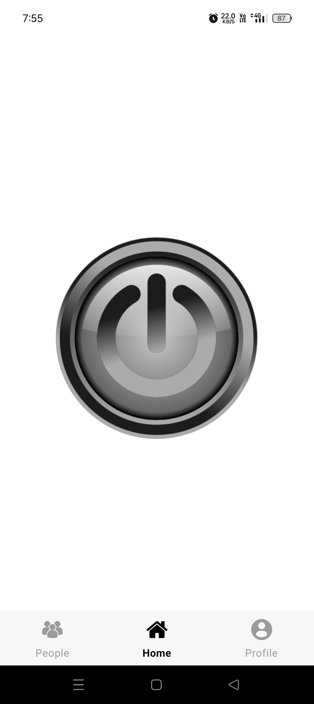
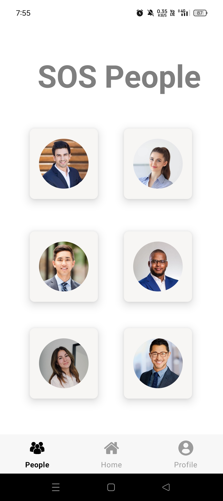
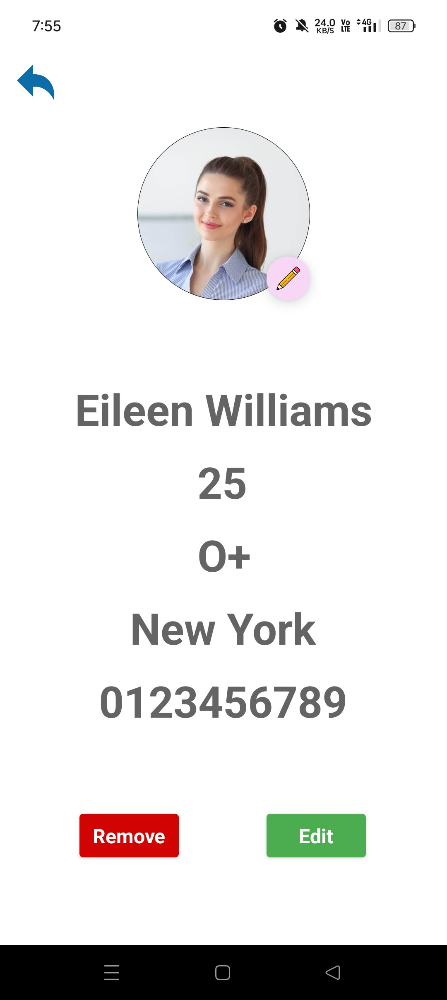
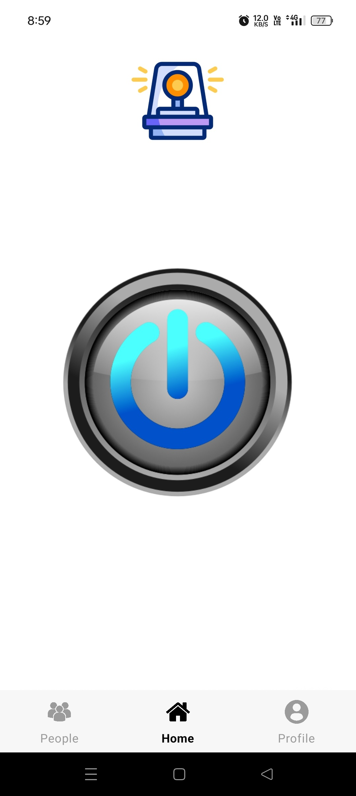
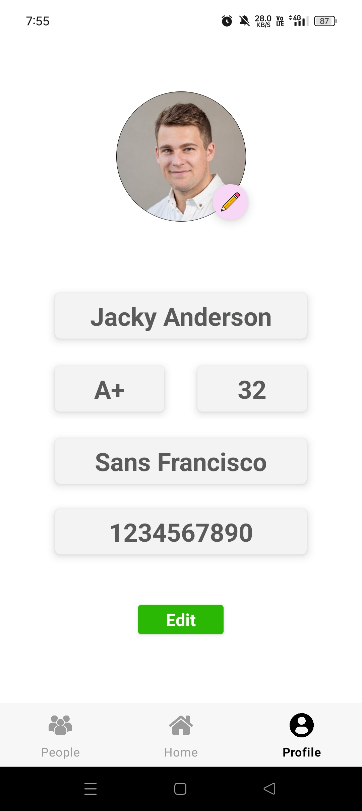

# 🚨 SafeCall - Emergency Alert App

An intuitive and privacy-focused **emergency alert app** built using **Kotlin** and **XML**, designed to send instant help messages to your trusted contacts with just one tap. Comes with animations, sounds, and a polished user experience.

---

## ✨ Features

- 🆘 **One-Tap Emergency Alert Button**
- 📍 **Real-Time GPS Location Sharing**
- 📞 **Send SMS to up to 6 trusted contacts**
- 🧑‍🤝‍🧑 **Add and edit emergency contacts**
- 🙋‍♂️ **User profile with blood group, address, and age**
- 🔊 **7-second alert sound with mute option**
- 🎨 **Beautiful animations and UI**
- 🔒 **All data stored locally — Privacy focused**

---

## 🛠 Tech Stack

- **Language:** Kotlin  
- **UI:** XML  
- **IDE:** Android Studio  
- **Architecture:** Simple, clean code structure (MVVM planned)

---

## 📱 Screens Overview

1. **Home Screen**  
   - Big emergency button with animation and alert sound  
   - Sends SMS with live location and Google Maps link to your saved contacts

2. **Contacts Screen**  
   - Add/Edit up to 6 emergency contacts with details and photos

3. **Profile Screen**  
   - View and edit your name, address, blood group, and photo

---

## 📸 Screenshots

<p align="center">
  
  
  
</p>

<p align="center"><i>Loading Screen &nbsp;&nbsp;&nbsp;|&nbsp;&nbsp;&nbsp; Home Screen &nbsp;&nbsp;&nbsp;|&nbsp;&nbsp;&nbsp; Saved Contacts</i></p>

<p align="center">
  
  
  
</p>

<p align="center"><i>Saved Contacts Details &nbsp;&nbsp;&nbsp;|&nbsp;&nbsp;&nbsp; Emergency Screen &nbsp;&nbsp;&nbsp;|&nbsp;&nbsp;&nbsp; Your Profile</i></p>

---

## 📲 Available on Google Play

The app is live on the **Google Play Store**!  
Click below to download and use SafeCall now:

<p align="left">
  <a href="https://play.google.com/store/apps/details?id=com.monotoshghosh.safecall">
    
  </a>
</p>

---

## ▶️ Getting Started

### 1. Clone the Repository

```bash
git clone https://github.com/monotoshghosh/SafeCall.git
```
### 2. Open in Android Studio

- Open the project from the cloned directory.
- Let **Gradle sync**.
- Connect your **Android device** or launch an **emulator**.
- Run the app and test emergency features!

---

## 📄 License

This project is licensed under the **Apache License 2.0**.  
See the [LICENSE](LICENSE) file for details.

---

## 🤝 Contributing

Contributions are welcome!  
Feel free to **fork the repository**, **submit issues**, and **open pull requests**.

---

## 👨‍💻 Developer

### Made with ❤️ by Monotosh
*– Stay Happy 😊*

---
